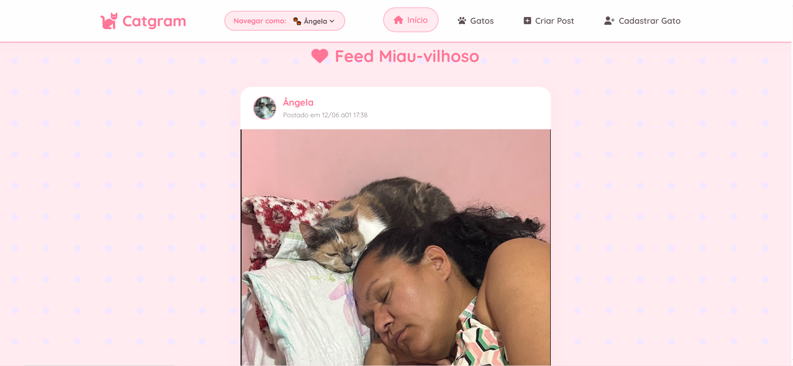
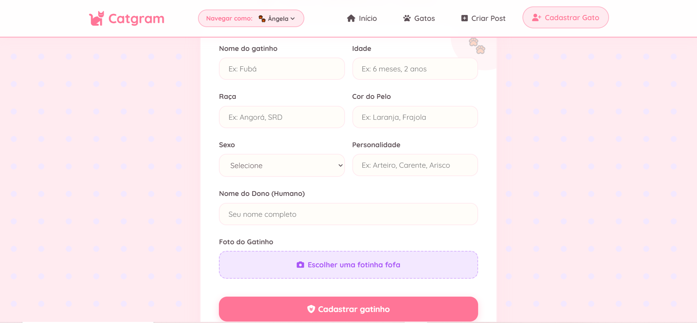
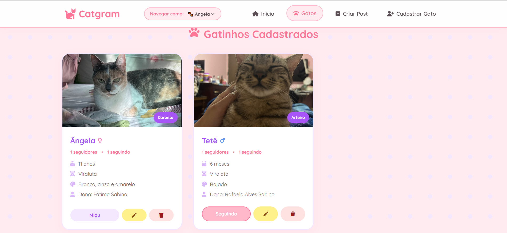
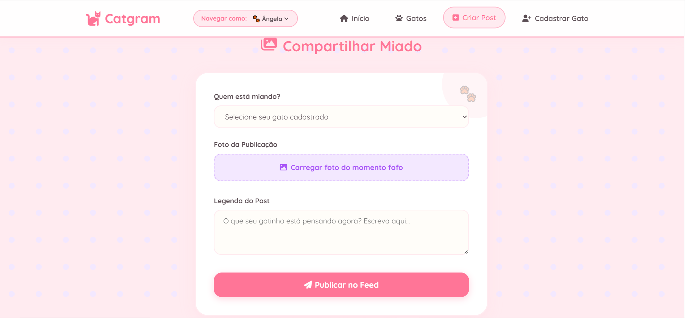

# 🐱 Catgram

O **Catgram** é um projeto desenvolvido para a matéria de **Desenvolvimento Web 2**.
A proposta do sistema é simular um Instagram para gatos, onde é possível cadastrar gatinhos, visualizar os gatos cadastrados, criar publicações, navegar pelo sistema com o gato escolhido, seguir outros gatos, curtir fotos e comentar nas postagens.

O projeto foi desenvolvido utilizando **PHP**, **MySQL**, **HTML**, **CSS** e **JavaScript**, com foco em praticar conceitos de desenvolvimento web, integração com banco de dados e funcionalidades de CRUD.

---

## 📌 Sobre o Projeto

O Catgram permite que o usuário cadastre o perfil do seu gato, adicionando informações como nome, idade, raça, cor, sexo, personalidade, nome do dono e foto.

Após o cadastro, é possível visualizar os gatos cadastrados no sistema e escolher um gatinho para navegar pelo Catgram. Com o gato selecionado, o usuário pode criar posts com fotos e legendas, visualizar publicações no feed inicial, curtir e comentar nas fotos de outros gatinhos. A ideia é criar uma rede social simples, divertida e temática voltada para gatos.

---

## 🚀 Funcionalidades

* Cadastro de gatos;
* Upload de foto do gato;
* Visualização dos gatos cadastrados;
* Navegação no sistema com o gato escolhido;
* Criação de posts com imagem e legenda;
* Visualização de publicações no feed;
* Curtidas em publicações;
* Comentários em posts;
* Opção de seguir outros gatinhos;
* Edição e exclusão de registros;
* Integração com banco de dados MySQL.

---

## 🛠️ Tecnologias Utilizadas

* PHP
* MySQL
* HTML5
* CSS3
* JavaScript
* XAMPP
* phpMyAdmin

---

## 🗂️ Estrutura do Projeto

```bash
catgram/
├── Assets/
│   ├── Inicio.png
│   ├── Cadastrar_gato.png
│   ├── Gatos_cadastrados.png
│   └── Criar_post.png
├── config/
│   └── db.php
├── Uploads/
├── Database.sql
├── Index.php
├── Processar_gato.php
├── Processar_post.php
├── Processar_seguidores.php
└── README.md

```

---

## 🐾 Banco de Dados

O projeto utiliza um banco de dados chamado:

```

Principais tabelas utilizadas:

* `gatos`: armazena os dados dos gatos cadastrados;
* `posts`: armazena as publicações feitas no feed;
* `comentarios`: armazena os comentários das publicações.
* `seguidores`: armazena a relação de seguidores entre os gatos cadastrados.

```

---

## 
📷 Telas do Sistema

### Tela Inicial / Feed de Publicações

Nesta tela são exibidas as publicações feitas pelos gatinhos cadastrados.
O usuário pode visualizar as fotos, legendas, curtidas e comentários, além de navegar no sistema com o gato selecionado.



---

### Tela de Cadastro do Gato

Nesta tela o usuário pode cadastrar um gatinho, informando seus dados principais e enviando uma foto.



---

### Tela de Gatos Cadastrados

Nesta área são exibidos os gatos cadastrados no Catgram.
O usuário pode visualizar os perfis disponíveis e escolher com qual gatinho deseja navegar pelo sistema.



---

### Tela de Criar Post

Nesta tela é possível criar uma publicação para um gato cadastrado, adicionando imagem e legenda.



---

## 🐱 Objetivo Acadêmico

O objetivo deste projeto é aplicar na prática os conhecimentos adquiridos na disciplina, utilizando PHP integrado ao banco de dados MySQL para criar uma aplicação web funcional com cadastro, listagem, edição, exclusão, upload de imagens e interações entre usuários.
